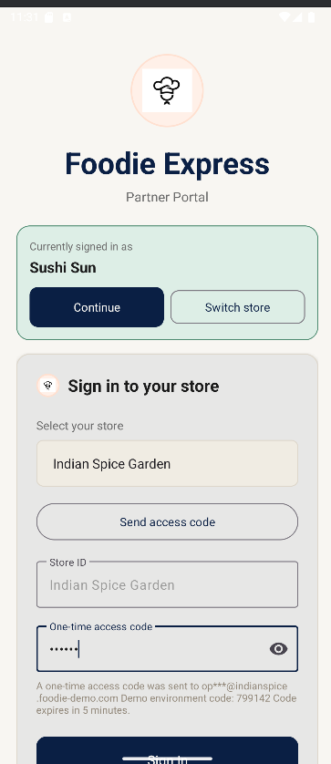

# Distributed Food Ordering System

Android client + Java TCP backend that simulates a real food delivery platform with customer and partner workflows.

## Why This Project Stands Out

- End-to-end distributed flow: Android app communicates with a multi-threaded socket server.
- Real product behavior: search, filtering, basket rules, ordering, and partner-side menu management.
- Clean separation of concerns: UI, services, repository, gateway, and communication layers.
- Practical engineering choices: thread-safe shared state, role-based screens, and dark mode support.
- Local persistence is backed by Room for order history instead of transient in-memory UI state.

## Architecture

```text
Android Activities
  -> Service Layer
    -> Repository Layer
      -> ServerGateway abstraction
        -> TcpServerGateway
          -> MasterCommunicator (TCP)
        -> MockServer (multi-threaded Java backend)
```

## Core Features

- Customer flow: browse stores, filter results, inspect menus, manage basket, place orders, view history.
- Partner flow: secure login, manager console, add/edit/remove products.
- Protocol examples: `SEARCH`, `BUY`, `PARTNER_LOGIN`, `ADD_PRODUCT`, `UPDATE_PRODUCT`, `REMOVE_PRODUCT`.
- Local configuration via settings for server IP/port.

## Tech Stack

- Android: Java, Material components, RecyclerView, ConstraintLayout
- Backend: Java 11, raw TCP sockets, concurrent client handlers
- Local persistence: Room database for order history, SharedPreferences for lightweight settings/session flags
- Backend persistence: SQLite-backed mock server storage via the `server` Gradle module
- Build: Gradle (Kotlin DSL)

## Run Locally

### 1) Start backend

```powershell
cd C:\Users\anezi\distributed-food-ordering-system
.\gradlew.bat :server:run
```

### 2) Build Android app

```powershell
.\gradlew.bat assembleDebug
```

### 2b) Run quality checks

```powershell
.\gradlew.bat testDebugUnitTest lintDebug
```

### 3) Connect app to backend

- Emulator: set server to `10.0.2.2:8765`
- Physical device (USB):

```powershell
adb reverse tcp:8765 tcp:8765
```

Then in app `Settings`, use `127.0.0.1:8765` for USB reverse mode.

## Persistence

- Orders are now stored locally in a Room database.
- Legacy order history stored in SharedPreferences is migrated automatically on first read/write.
- Backend restaurant and inventory data are persisted in SQLite and reloaded on server restart.

This distinction matters in interviews: the Android client demonstrates real local database usage, and the backend now persists state in SQLite while still remaining a deliberately simple mock server rather than a full production service.

## Testing

- Unit tests cover basket logic, protocol helpers, repository parsing, partner auth flow, product management flow, and order submission edge cases.
- Service tests run through injected fakes rather than a live socket, so failure cases are deterministic and fast.
- Recommended verification command:

```powershell
.\gradlew.bat clean testDebugUnitTest assembleDebug lintDebug
```

## Design Tradeoffs

### Why TCP and not REST?

- This project deliberately uses raw TCP as a learning-oriented transport choice.
- It gives full control over the request/response protocol and makes connection handling, message formats, and transport failures explicit.
- The app is no longer tightly coupled to TCP at the service boundary because communication now goes through a `ServerGateway` abstraction. That makes a future REST migration incremental instead of a full rewrite.

### How is concurrency handled?

- The mock backend uses a thread-per-client model.
- Shared collections are synchronized where writes matter, so concurrent partner/customer actions do not corrupt shared state.
- On Android, long-running work such as purchases and order-history loading is executed off the main thread to avoid blocking the UI.

### What would be improved next?

- Introduce a REST or gRPC API surface if the goal shifts from transport learning to production-style service design.
- Add protocol/integration tests around the backend command handling and automate them in CI.

## Screenshots

All assets are in `docs/screenshots/`.

Click any screenshot to open full size. The gallery below reflects the latest April 2026 UI refresh.

### Customer Journey

| Welcome | Home | Filters |
|---|---|---|
| [](docs/screenshots/welcome.png) | [](docs/screenshots/home.png) | [](docs/screenshots/filters.png) |

| Restaurant Details | Basket Before Order | Basket After Order |
|---|---|---|
| [](docs/screenshots/restaurant-details.png) | [](docs/screenshots/basket-before-order.png) | [](docs/screenshots/basket-after-order.png) |

| Order History | Settings |
|---|---|
| [](docs/screenshots/order-history.png) | [](docs/screenshots/settings.png) |

### Partner Journey

| Partner Login | Access Code Flow | Manager Console |
|---|---|---|
| [](docs/screenshots/partner-login.png) | [](docs/screenshots/partner-login-access-code.png) | [](docs/screenshots/manager-console.png) |

| Add Product | Edit Products |
|---|---|
| [](docs/screenshots/add-product.png) | [](docs/screenshots/edit-products.png) |

## Recruiter Notes

- Demonstrates both mobile development and distributed systems fundamentals.
- Shows concurrent backend design with shared state constraints.
- Includes two real user roles (customer and business partner), not a single-screen demo.
- Demonstrates practical refactoring: transport abstraction, local database persistence, and service-level testability were added without changing the user-facing flows.

## Next Improvements

- Add protocol integration tests for server command handling.
- Add CI pipeline for build/test checks.
