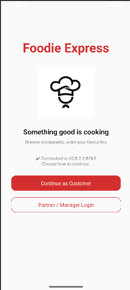
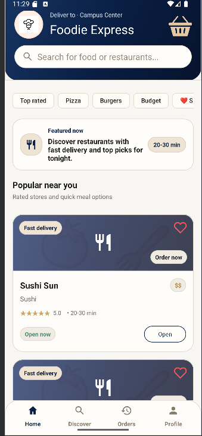
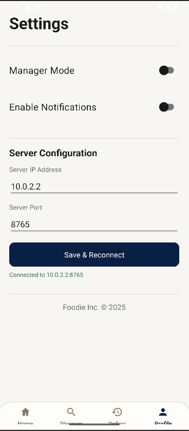

# Distributed Food Ordering System
> A full-stack Android food ordering platform built on a **Master–Worker distributed architecture** with real-time TCP socket communication.
---
## The Problem
Online food ordering platforms need to handle concurrent requests from many users — searching restaurants, placing orders, and managing menus — reliably and in real time.
This project builds such a platform from scratch, using a **distributed backend** (Master + Worker nodes) and a **native Android client**, connected over raw TCP sockets with a custom JSON protocol.
---
## Architecture
```
+---------------------------------------------------------+
¦                   Android Client App                    ¦
¦                                                         ¦
¦  WelcomeActivity --? MainActivity --? RestaurantDetails ¦
¦                           ¦                   ¦         ¦
¦                           ?                   ?         ¦
¦                     FiltersActivity     BasketActivity  ¦
¦                                                         ¦
¦  PartnerLoginActivity --? ManagerConsole                ¦
¦                                ¦                        ¦
¦                    AddProduct / EditProduct              ¦
+---------------------------------------------------------+
                         ¦
                  TCP Socket (port 8765)
                  JSON protocol
                         ¦
              +----------?----------+
              ¦    Master Server    ¦
              ¦                     ¦
              ¦  Receives requests  ¦
              ¦  Routes to Workers  ¦
              ¦  Aggregates results ¦
              +---------------------+
                     ¦      ¦
          +----------?--+ +-?----------+
          ¦  Worker  1  ¦ ¦  Worker  2  ¦  ...
          ¦             ¦ ¦             ¦
          ¦Restaurant A ¦ ¦Restaurant B ¦
          ¦Restaurant C ¦ ¦Restaurant D ¦
          +-------------+ +-------------+
```
**How it works:**
- The Android app opens a **persistent TCP socket** to the Master
- The client sends requests like `SEARCH:lat:lon:cuisine:stars:price`
- The Master **routes the request** to the appropriate Worker nodes
- Workers process the request and respond
- The Master **aggregates** all Worker responses and returns one JSON result to the client
---
## Features
| Feature | Description |
|---|---|
| ?? **Restaurant search** | Real-time search with text query matching |
| ??? **Advanced filters** | Filter by cuisine, stars (1–5), price range, distance |
| ?? **Restaurant details** | Full menu view per restaurant |
| ?? **Basket** | Add/remove items, quantity stepper, single-store enforcement |
| ?? **Checkout** | Submit order to server in real time |
| ?? **Partner login** | Secure one-time access code authentication |
| ????? **Manager console** | Live inventory snapshot (total / low stock / out of stock) |
| ? **Add product** | Create new menu items from the app |
| ?? **Edit product** | Update price, stock, availability |
| ??? **Delete product** | Remove menu items with confirmation |
| ?? **Server config** | Change server IP/port at runtime from Settings — no recompile needed |
---
## Screenshots
| Welcome | Home | Restaurant | Basket |
|---|---|---|---|
|  |  |  |  |
| Partner Login | Manager Console | Product Management | Settings |
|---|---|---|---|
|  |  |  |  |
---
## Setup & Running
### Prerequisites
- Android Studio (Hedgehog / Electric Eel or newer)
- JDK 17+
- An Android device or emulator on the **same network** as the server
### 1 — Run the Mock Server (local demo)
```bash
# In the project root
javac MockServer.java
java MockServer
# Server starts on port 8765
```
The emulator connects automatically via `10.0.2.2:8765`.
### 2 — Build & Run the App
```bash
./gradlew assembleDebug
# or open in Android Studio and press Run ?
```
### 3 — Real Device
1. Connect your phone to the same WiFi as your PC
2. Find your PC's local IP: `ipconfig` (Windows) / `ifconfig` (Mac/Linux)
3. Open the app ? **Settings ? Server Configuration**
4. Enter your PC's IP + port `8765` ? **Save Server Settings**
---
## Key Technical Decisions
| Decision | Reason |
|---|---|
| Raw TCP sockets | Matches the distributed systems requirement; no HTTP overhead |
| Custom text protocol (`COMMAND:arg1:arg2`) | Simple to parse, easy to debug |
| DiffUtil in RecyclerView | Smooth animated list updates without full redraws |
| Deep copy in `Basket.getItems()` | Prevents DiffUtil comparing stale references after in-place mutations |
| Thread-safe singleton `Basket` | Multiple activities read/write the basket concurrently |
| `ServerConnection.ensureReady()` | Auto-reconnects if the socket drops between requests |
| Session persistence (`PartnerSessionStore`) | Partners stay logged in across app restarts |
---
## Project Structure
```
app/src/main/java/com/example/restaurantapp/
+-- Activities
¦   +-- WelcomeActivity.java           # Entry point + server connection bootstrap
¦   +-- MainActivity.java              # Restaurant list, search, quick filters
¦   +-- FiltersActivity.java           # Advanced search filters
¦   +-- RestaurantDetailsActivity.java # Menu view for a restaurant
¦   +-- BasketActivity.java            # Shopping basket + checkout
¦   +-- SettingsActivity.java          # Server config, manager mode
¦   +-- PartnerLoginActivity.java      # One-time code partner auth
¦   +-- ManagerConsoleActivity.java    # Inventory dashboard
¦   +-- AddProductActivity.java        # Add menu item
¦   +-- EditProductActivity.java       # List products (edit/delete)
¦   +-- ProductEditActivity.java       # Edit a single product
+-- Network
¦   +-- ServerConnection.java          # Thread-safe singleton TCP wrapper
¦   +-- MasterCommunicator.java        # All TCP request/response methods
+-- Services
¦   +-- RestaurantRepository.java      # Search + fetch stores
¦   +-- ProductManagementService.java  # Add / update / remove products
¦   +-- PartnerAuthService.java        # Partner login flow
¦   +-- OrderService.java              # Submit purchase order
+-- Models
¦   +-- Store.java                     # Restaurant data model + JSON
¦   +-- Product.java                   # Menu item data model + JSON
¦   +-- Basket.java                    # Thread-safe order accumulator
¦   +-- BasketItem.java                # Single basket line item
+-- Utilities
    +-- ActivityUtils.java             # Connection guards, UI-thread helper
    +-- AppResult.java                 # Generic success/error wrapper
    +-- PartnerSessionStore.java       # SharedPreferences session management
    +-- StoreJsonParser.java           # JSON parsing helpers
```
---
## Technologies
- **Java** — primary language (Android client + mock server)
- **Android SDK** — UI, lifecycle, RecyclerView, Material Design
- **TCP Sockets** — raw socket communication (`java.net.Socket`)
- **JSON** — data format (`org.json`)
- **Gradle (Kotlin DSL)** — build system
- **DiffUtil** — efficient RecyclerView diffing
- **SharedPreferences** — local session + settings persistence
- **GitHub Actions** — CI pipeline (assembleDebug on every push)
---
## CV Bullets
> Ready to paste into your résumé or LinkedIn:
- Built a **distributed food ordering platform** using Java, Android, TCP sockets, and JSON-based client–server communication
- Implemented a **Master–Worker architecture** with request routing and response aggregation across multiple backend nodes
- Developed full **restaurant discovery, filtering, basket, checkout**, and **partner-side product management** flows end-to-end
- Engineered **connection lifecycle management** with auto-reconnect, async data loading, and thread-safe state across concurrent Activities
- Applied **DiffUtil + deep-copy patterns** to eliminate stale-reference bugs in animated RecyclerView updates
- Added **runtime server reconfiguration** from the Settings screen — no recompile needed to switch networks or devices
- Maintained code quality through a **layered architecture** (UI ? Service ? Network ? Model) with a consistent `AppResult<T>` error contract
---
## Academic Context
Developed as part of the **Distributed Systems** course at the  
**Athens University of Economics and Business (AUEB)** — Department of Computer Science.
The project demonstrates:
- Custom application-level protocol design over TCP
- Concurrent request handling from multiple clients
- Real-time inventory and order management
- Mobile client integration with a distributed backend
---
## Author
**Sotiris Kylintireas**  
Computer Science — Athens University of Economics and Business (AUEB)  
GitHub: [KingKyli](https://github.com/KingKyli)
