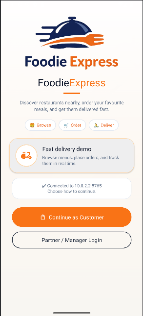
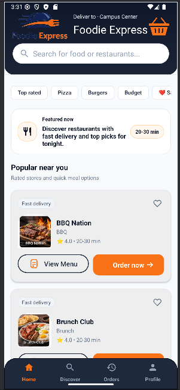
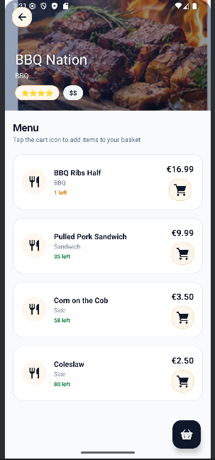
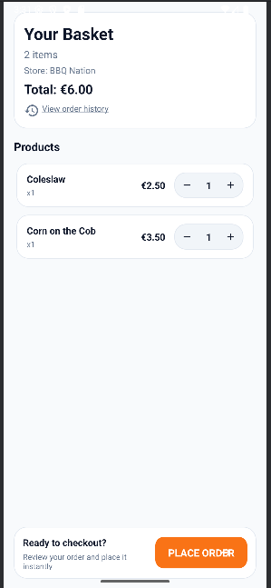
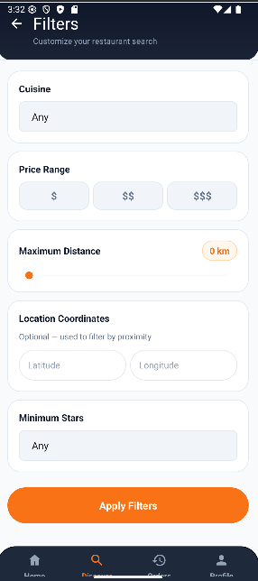
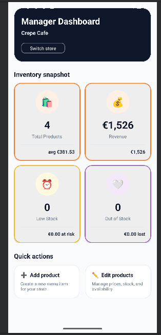
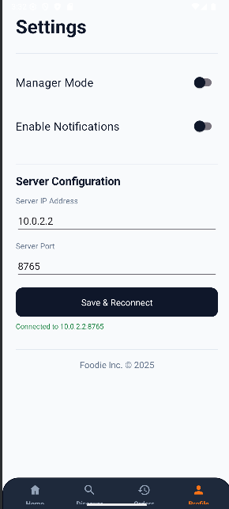

# Distributed Food Ordering System

FoodieExpress is a distributed food ordering demo that combines a native Android client with a Java TCP backend and SQLite persistence. It is designed as an end-to-end systems project, not only as a UI showcase.

The project supports two main roles:
- Customer flow for browsing stores, filtering results, viewing products, adding items to a basket, and placing orders
- Partner or manager flow for requesting a one-time access code, signing in, and managing inventory

## Highlights

- Native Android app written in Java
- Java 11 backend with a custom line-based TCP protocol
- SQLite-backed server persistence
- Customer and partner workflows in the same system
- Local order history and configurable server connection in the app
- Backend validation for access codes, duplicate stores, price and stock rules, and transactional updates
- Automated tests including socket-level integration tests for protocol flows

## Tech Stack

- Android client: Java, Android SDK, Material Components, Room
- Backend: Java 11, TCP sockets, SQLite JDBC
- Build system: Gradle with Kotlin DSL
- Testing: JUnit 5

## Screenshots

<table>
  <tr>
    <td align="center">
      
      <br />
      <strong>Welcome screen</strong>
    </td>
    <td align="center">
      
      <br />
      <strong>Customer home</strong>
    </td>
    <td align="center">
      
      <br />
      <strong>Restaurant menu</strong>
    </td>
  </tr>
  <tr>
    <td align="center">
      
      <br />
      <strong>Basket and checkout</strong>
    </td>
    <td align="center">
      
      <br />
      <strong>Search filters</strong>
    </td>
    <td align="center">
      
      <br />
      <strong>Order history</strong>
    </td>
  </tr>
  <tr>
    <td align="center">
      
      <br />
      <strong>Partner login</strong>
    </td>
    <td align="center">
      
      <br />
      <strong>Manager dashboard</strong>
    </td>
    <td align="center">
      
      <br />
      <strong>Server settings</strong>
    </td>
  </tr>
</table>

## System Architecture

```text
Android UI
  -> Activities / Services
    -> Repository / Gateway layer
      -> TCP communication
        -> MockServer
          -> ServerCommandProcessor
            -> StoreService
              -> StoreRepository
                -> SQLite
```

## Key Flows

### Customer

- Browse restaurants and featured content
- Search and filter by cuisine, price, distance, coordinates, and rating
- Open a restaurant and add products to the basket
- Place an order through the backend
- View local order history and reorder past items

### Partner / Manager

- Request a one-time access code for a store
- Sign in through the partner portal
- Open the manager dashboard
- Add, edit, update, or remove products

## Protocol Commands

The backend exposes a custom TCP command protocol. Core commands include:

- `CLIENT_HELLO`
- `SEARCH`
- `BUY`
- `REQUEST_PARTNER_ACCESS_CODE`
- `PARTNER_LOGIN`
- `GET_CREDENTIALS`
- `ADD_STORE`
- `REMOVE_STORE`
- `ADD_PRODUCT`
- `REMOVE_PRODUCT`
- `UPDATE_PRODUCT`

## Project Structure

```text
app/           Android client
server/        Java backend server
docs/          Supporting docs and screenshots
server-data/   Local persisted backend data
```

## Quick Start

### Option A: One-command startup on Windows

Run the full demo flow:

```powershell
.\quick-start.ps1
```

This script can:
- start the emulator
- build the app
- start the backend on port `8765`
- install and launch the Android app

If the emulator is already running:

```powershell
.\quick-start.ps1 -SkipEmulator
```

If the app is already built:

```powershell
.\quick-start.ps1 -SkipBuild
```

### Option B: Manual startup

1. Start the emulator:

```powershell
.\start-emulator.ps1
```

2. Start the backend server:

```powershell
.\start-server.ps1
```

3. Build the Android app:

```powershell
.\gradlew.bat :app:assembleDebug
```

4. Install the app:

```powershell
.\gradlew.bat :app:installDebug
```

5. Launch the app:

```powershell
adb shell am start -n com.example.restaurantapp/.WelcomeActivity
```

## Android Studio Run

If you prefer running from Android Studio:

1. Start the emulator first
2. Start the backend in a separate terminal
3. Press Run in Android Studio

Detailed guide: [ANDROID_STUDIO.md](ANDROID_STUDIO.md)

## Backend Connection

- Default backend port: `8765`
- Android emulator host: `10.0.2.2:8765`
- For a USB-connected physical device:

```powershell
adb reverse tcp:8765 tcp:8765
```

When using `adb reverse`, configure the app to connect to `127.0.0.1:8765`.

## Build and Test

Build the Android app:

```powershell
.\gradlew.bat :app:assembleDebug
```

Run backend tests:

```powershell
.\gradlew.bat :server:test
```

Run Android unit tests:

```powershell
.\gradlew.bat :app:testDebugUnitTest
```

Run Android lint:

```powershell
.\gradlew.bat :app:lintDebug
```

Run the main local verification set:

```powershell
.\gradlew.bat :server:test :app:testDebugUnitTest :app:lintDebug :app:assembleDebug
```

## Backend Guarantees

The server layer currently enforces:

- strict command input validation
- 6-digit partner access code validation
- prevention of duplicate active access code requests
- duplicate store protection
- non-negative price and inventory checks
- transactional persistence with rollback behavior on failure

## Notes

- The backend entry point is `MockServer` and listens on port `8765`
- The Android app package is `com.example.restaurantapp`
- The minimum Android SDK is `28`

## Additional Docs

- [START_HERE.md](START_HERE.md)
- [ANDROID_STUDIO.md](ANDROID_STUDIO.md)
- [SCRIPTS.md](SCRIPTS.md)
- [CHANGES_MADE.md](CHANGES_MADE.md)
- [HEADER_REDESIGN.md](HEADER_REDESIGN.md)
- [RESTAURANT_CARD_REDESIGN.md](RESTAURANT_CARD_REDESIGN.md)

## Current Scope

This repository is already a strong demo of a distributed ordering system. It is not positioned as a production deployment template yet. Areas still outside the current scope include full auth hardening, deployment automation, metrics and tracing, and load testing.
