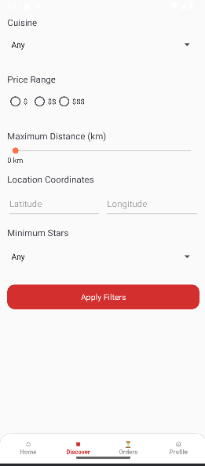
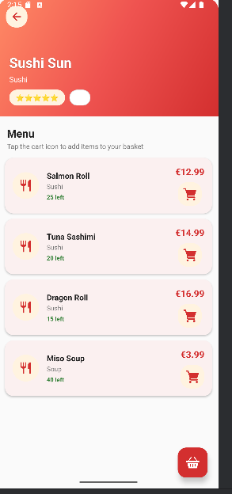
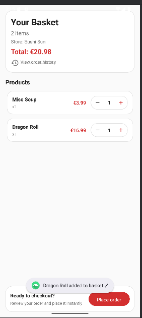
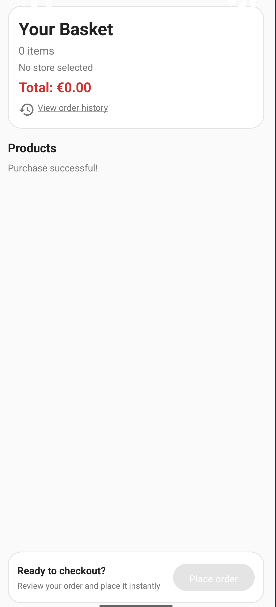
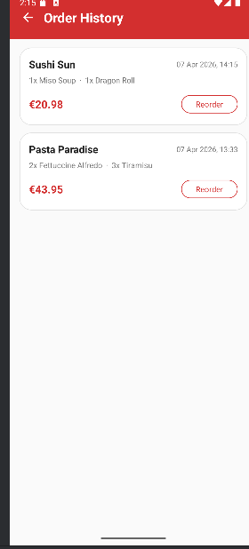
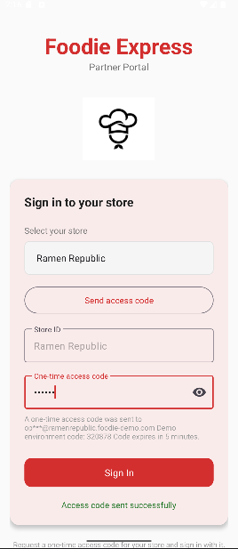
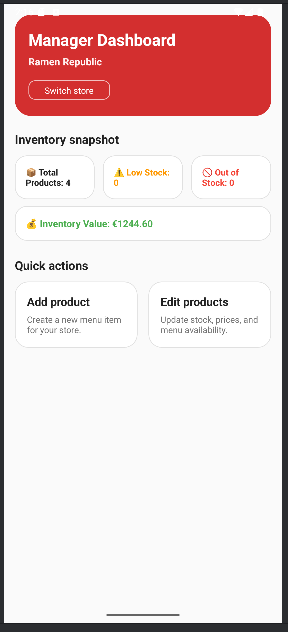
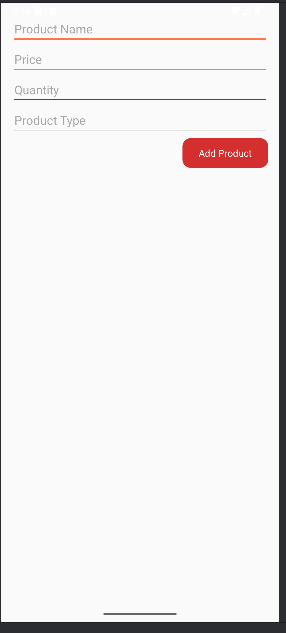
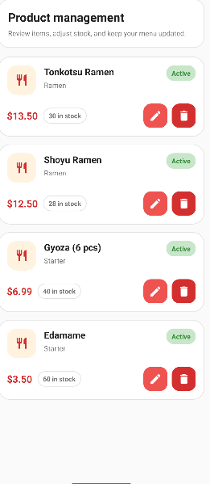

# Distributed Food Ordering System

Android client + Java TCP backend that simulates a real food delivery platform with customer and partner workflows.

## Why This Project Stands Out

- End-to-end distributed flow: Android app communicates with a multi-threaded socket server.
- Real product behavior: search, filtering, basket rules, ordering, and partner-side menu management.
- Clean separation of concerns: UI, services, repository, and communication layers.
- Practical engineering choices: thread-safe shared state, role-based screens, and dark mode support.

## Architecture

```text
Android Activities
  -> Service Layer
    -> Repository Layer
      -> MasterCommunicator (TCP)
        -> MockServer (multi-threaded Java backend)
```

## Core Features

- Customer flow: browse stores, filter results, inspect menus, manage basket, place orders, view history.
- Partner flow: secure login, manager console, add/edit/remove products.
- Protocol examples: `SEARCH`, `BUY`, `PARTNER_LOGIN`, `ADD_PRODUCT`, `UPDATE_PRODUCT`, `REMOVE_PRODUCT`.
- Local configuration via settings for server IP/port.

## Tech Stack

- Android: Java, Material components, RecyclerView, ConstraintLayout
- Backend: Java 11, raw TCP sockets, concurrent client handlers
- Storage: SharedPreferences
- Build: Gradle (Kotlin DSL)

## Run Locally

### 1) Start backend

```powershell
cd C:\Users\anezi\distributed-food-ordering-system
javac MockServer.java
java MockServer
```

### 2) Build Android app

```powershell
.\gradlew.bat assembleDebug
```

### 3) Connect app to backend

- Emulator: set server to `10.0.2.2:8765`
- Physical device (USB):

```powershell
adb reverse tcp:8765 tcp:8765
```

Then in app `Settings`, use `127.0.0.1:8765` for USB reverse mode.

## Screenshots

All assets are in `docs/screenshots/`.

Click any screenshot to open full size.

### Customer Journey

| Welcome | Home | Filters |
|---|---|---|
| [](docs/screenshots/welcome.png) | [](docs/screenshots/home.png) | [](docs/screenshots/filters.png) |

| Restaurant Details | Basket Before Order | Basket After Order |
|---|---|---|
| [](docs/screenshots/restaurant-details.png) | [](docs/screenshots/basket-before-order.png) | [](docs/screenshots/basket-after-order.png) |

| Order History | Settings |
|---|---|
| [](docs/screenshots/order-history.png) | [](docs/screenshots/settings.png) |

### Partner Journey

| Partner Login | Manager Console |
|---|---|
| [](docs/screenshots/partner-login.png) | [](docs/screenshots/manager-console.png) |

| Add Product | Edit Products |
|---|---|
| [](docs/screenshots/add-product.png) | [](docs/screenshots/edit-products.png) |

## Recruiter Notes

- Demonstrates both mobile development and distributed systems fundamentals.
- Shows concurrent backend design with shared state constraints.
- Includes two real user roles (customer and business partner), not a single-screen demo.

## Next Improvements

- Add protocol integration tests for server command handling.
- Add persistent backend storage.
- Add CI pipeline for build/test checks.
